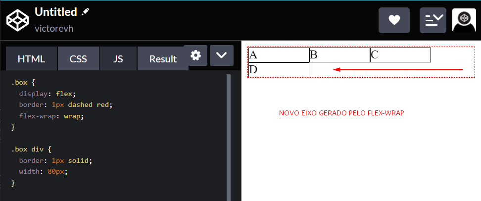

# Propriedades do Flex Container

* Direção dos itens
* Multi linhas
* Alinhamento
  * Principal
  * Cruzado
* Espaços entre os itens

## Direção dos itens

* Flex é uma dimensão (hrizontal ou vertical)
* podemos mudar a direção com `flex-direction`
* valores: ( `row` | `row-reverse` | `column` | `column-reverse` )
* Por padrão o `flex-direction:` é `row`

## `flex-wrap`

* Podemos usar multi linhas.
* Cada nova linha um novo flex container.
* você também pode inverter a ordem dos elementos com o `flex-wrap: wrap-reverse;`

## `flex-flow`

* shorthand
* `flex-direction` || `flex-wrap`

**Exemplo**

~~~css
.div {
    flex-flow: row wrap;
}
~~~

## `justify-content`

* Alinhamento dos elementos dentro do container
* Distribuição dos elementos

### Valores

* `flex-start`
* `flex-end`
* `center`
* `space-around`
* `space-between`
* `space-evenly`

## `align-items`

* Alinhamento dos elementos no eixo cruzado
* Valor padrão é o `stretch` (esticar)

### valores

* `stretch`
* `flex-start`
* `flex-end`
* `center`

## `gap`

* Espaços entre os elementos

### valores

* Unidades de medidas
* fixas: px, pt
* flexíveis: %, em, rem

