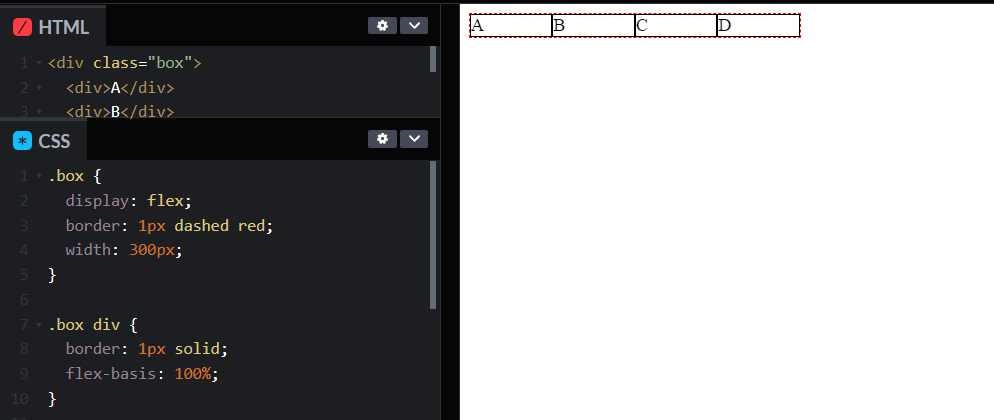
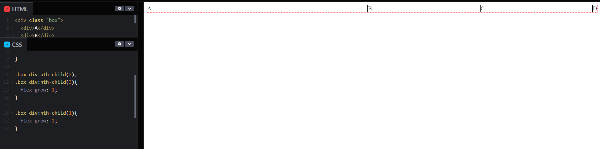
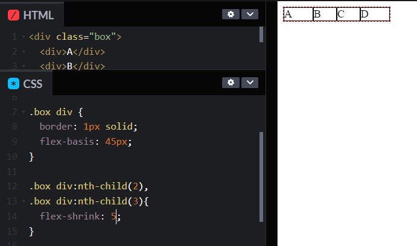
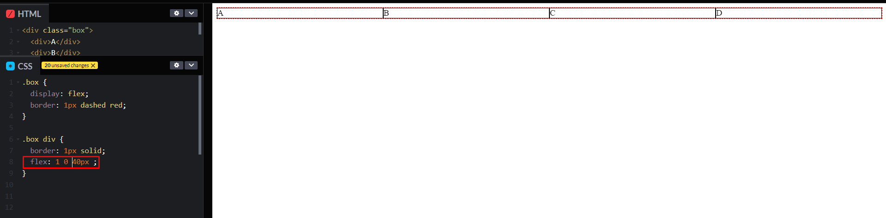
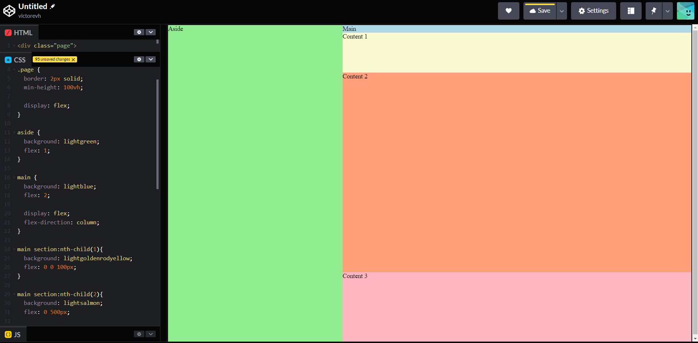
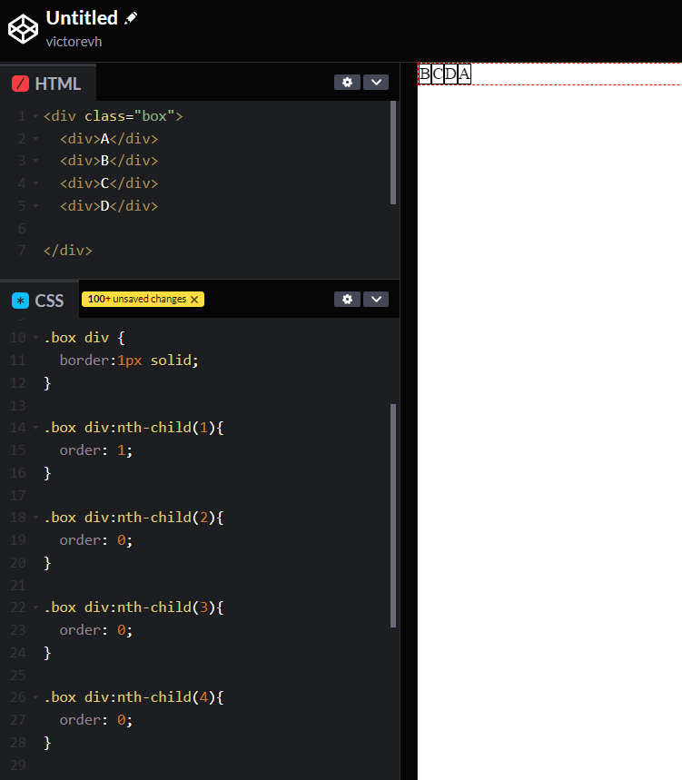

# Propriedades para os itens

* `flex-basis`
* `flex-grow`
* `flex-shrink`
* `flex`
* `order`
  

## `flex-basis`

* Define a largura ou altura de todos os itens dentro de uma div (a depender da direção flex dos itens "row" or "column").
  

## `flex-grow`

* O crescimento do item dentro do container em relação aos espaços vazios.
  

## `flex-shrink`

* A capacidade do item encolher dentro do container.

## `flex` shorthand

* shorthand
* `flex-grow` | `flex-shrink` | `flex-basis` (segue essa ordem no shorthand)
* podem ter 1, 2 ou 3 valores

## Alterando tamanho de mútiplos itens

## `order`

* Define visualmente as ordens dos elementos (não recomendado devido a acessibilidade)

