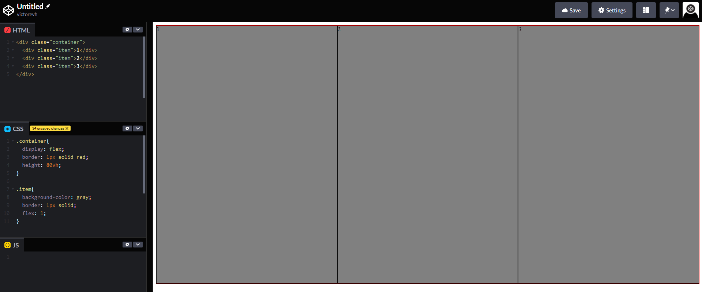

# Terminologia

- Flex Container (Elemento pai)
  - Flex item 
- Nesting (Elementos filhos)
- Axis (Eixos)
  - main (eixo X)
    - start, end 
  - cross (eixo y)
    - start, end
- Flex sizing
  - flexível
  - altera width/height dos itens para preenchimento dos espaços do flex container

## Exemplo do flex sizing

* Observe que ao adicionar o `flex: 1;` os itens se ajustam a tela mesmo sem altura ou largura definida
  

