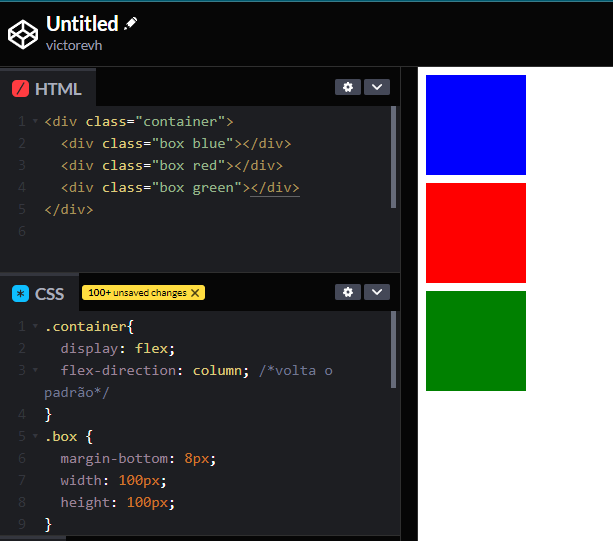
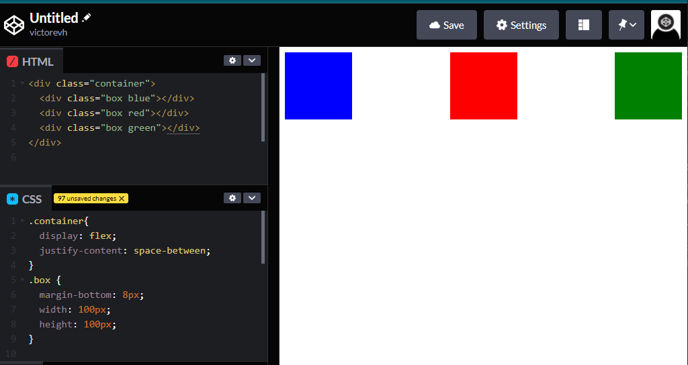
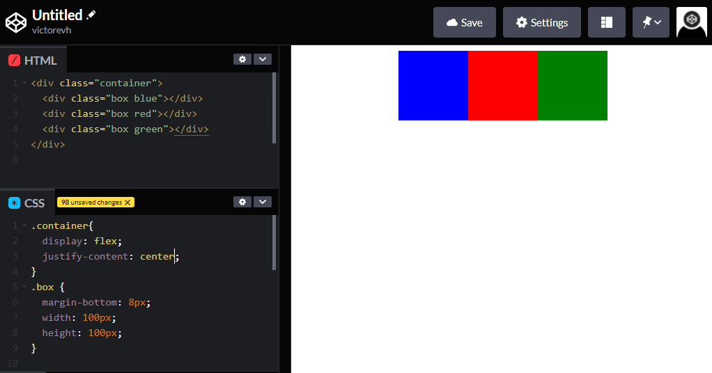
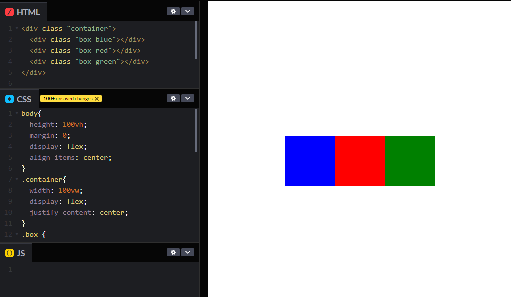

# `Flexbox`

* Nos permite posicionar os elementos dentro da caixa.
* Controle em uma dimensão (horizontal ou vertical)
* Alinhamento, direcionamento, ordenar e tamanhos

~~~css
div.parent {
    display: flex;
}
~~~

## `flex-direction`

* Qual a direção do flex: horizontal ou vertical
* row | column

### Exemplo do `flex-direction: column` cancelando a direção `row` que é padrão do `display: flex;`

## alinhamento

### `justify-content: space-between;`

### `justify-content: center;`

### `align-items`

