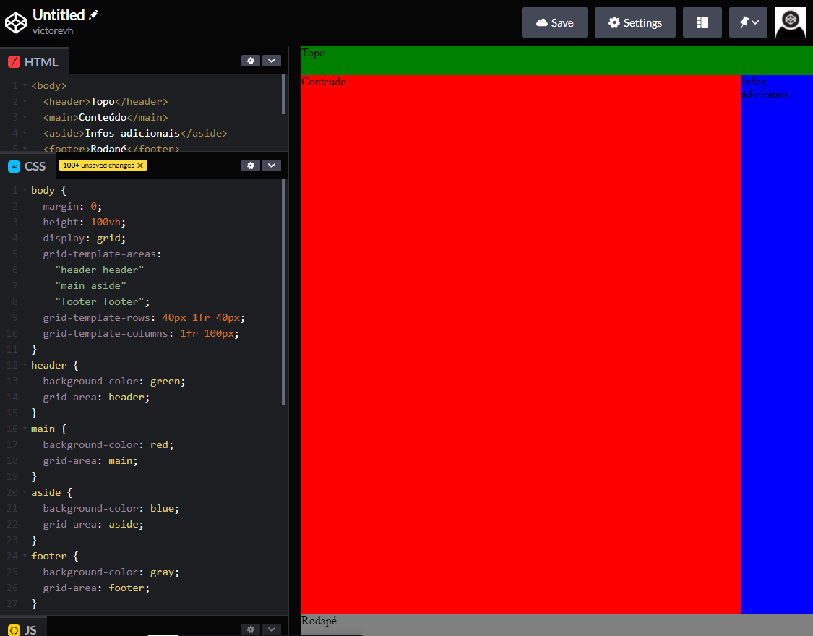
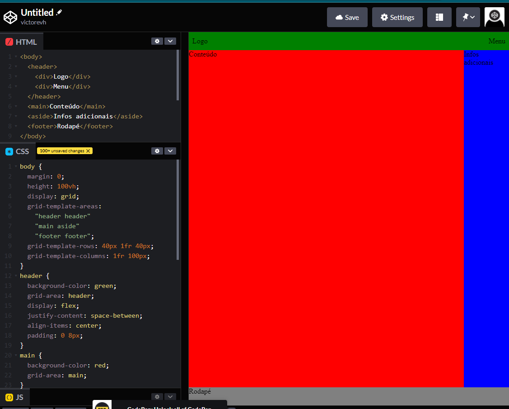

# Grid

* Posicionamento dos elementos dentro da caixa
* Posicionamento horizontal e vertical ao mesmo tempo
* Pode ser flexível ou fixo
* Cria espaços para os elementos filhos habitarem

~~~css
body{
    grid-template-areas:
    "exemplo 2"
    "1 2"
    "1 2"; /* Organização de linhas e colunas*/

    grid-template-rows: 40px 1fr 40px; /* 40px na linha 1, 1flexivel na linha 2, 40px na linha 3*/
    grid-template-columns: 1fr 100px; /* 1flexivel na coluna 1, 100px na coluna 2*/
    grid-area: exemplo; /* localiza o elemento na marcação do grid-template-areas:*/
}
~~~~

## Grid e Flexbox

