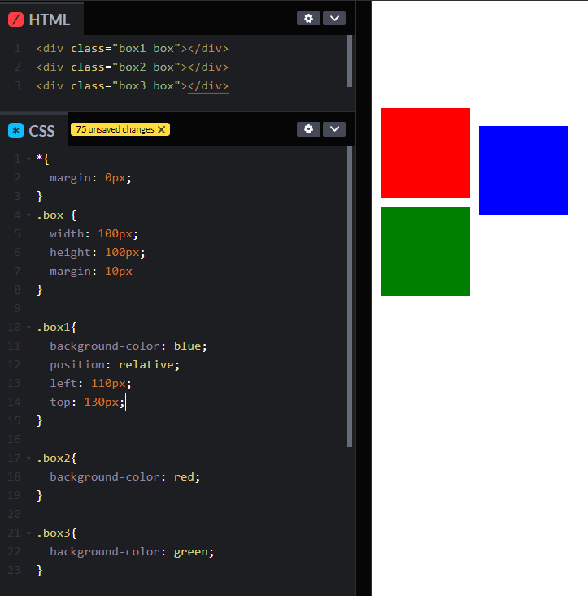
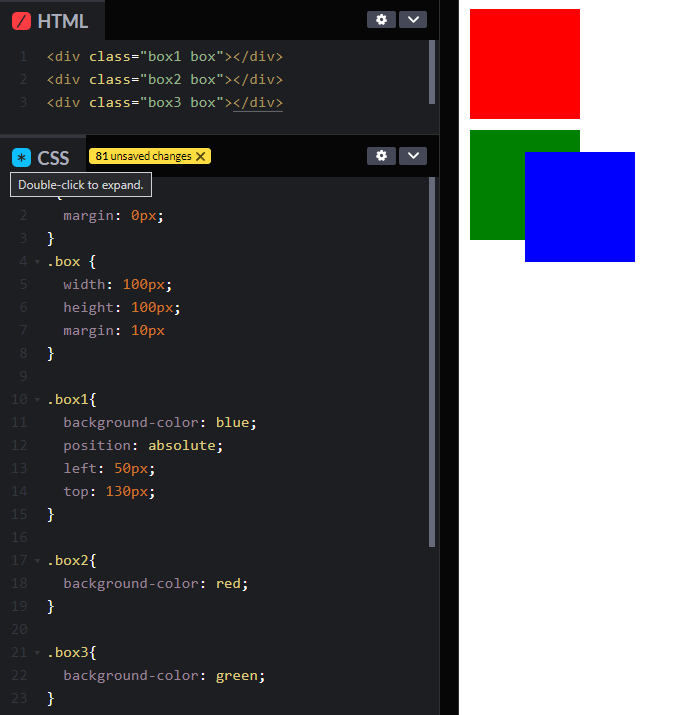

# Page Layouts

* Tables
* Floats e clear
* Frameworks e Grid Systems
* Flexbox
* Grid

## Posicionamentos

Controlar onde, na página o elemento irá ficar, alterando o fluxo normal dos elementos.

- Name: `position`
- Value: `static | relative | absolute | fixed`

## `static`

* O padrão é o static seguindo o fluxo normal, ficando um abaixo do outro.

## `relative`

* top, right, bottom, left, z-index

### Exemplo

## `absolute`

* Puxa o elemento para uma nova layer, a frente dos demais
* Caso o elemento pai possua um posicionamento, o comportamento vai ser relacionado ao posicionamento do elemento pai

### Exemplo

  
## `fixed`

* Fixa o elemento na página